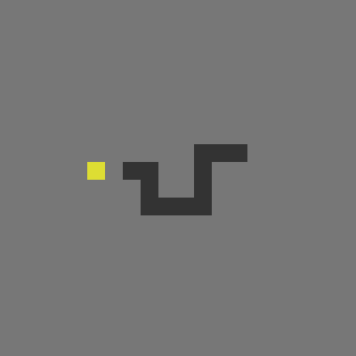

# Snake

Javascript implementation of snake with an input queue. The game board resizes to fit the browser window. If the snake goes outside the gameboard or runs into itself, the game is lost. If the snake takes up the entire gameboard, the game is won.

